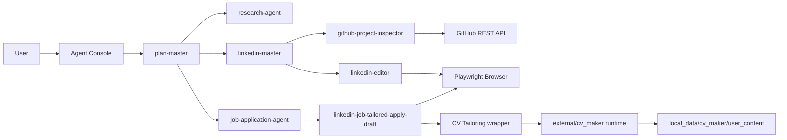

# OfferGraph

<p align="center">
  
</p>

<p align="center">
  
  
  
  <a href="https://github.com/jhcook/cv">
    
  </a>
</p>

An Offer hunter ai agent team based on LangGraph, allowed monitor and future customize, and have manus agent error memory feat, to give users a free, efficient, cheap way to get easy offer.

## What OfferGraph Does

OfferGraph is an agent workspace for the offer-hunting loop: planning, research,
LinkedIn content, CV tailoring, and browser-assisted workflows with explicit
approval gates.

| Area | Capability |
| --- | --- |
| Plan Master | Coordinates research, sub-agents, TODOs, and workflow handoffs |
| LinkedIn Master | Creates LinkedIn post drafts and routes browser publishing through approval gates |
| Embedded CV Maker | Tailors resumes and cover letters through OfferGraph's application flow |
| GitHub Project Data | Reads repository metrics and recent project progress for LinkedIn content |
| Browser Tools | Uses Playwright for authenticated LinkedIn flows |
| Safety Controls | Keeps login, publishing, and future application submission user-controlled |

## Architecture



## Setup

```bash
/opt/homebrew/bin/python3.11 -m venv .venv
source .venv/bin/activate
python -m pip install --upgrade pip
python -m pip install -r requirements.txt
cp .env.example .env
```

Fill `.env` with local secrets:

```bash
TAVILY_API_KEY=...
MINIMAX_API_KEY=...
# Optional, for higher GitHub API rate limits.
GITHUB_TOKEN=...
```

## Agent Console

Start the top-level OfferGraph agent:

```bash
./offergraph
```

This opens a chat loop controlled by `plan-master`. Job application flows use the
integrated LinkedIn apply tool to call CV Maker, then return to the browser.

Exit with `/exit`.

Run a single non-interactive task:

```bash
./offergraph --message "Find AI Engineer roles and prepare applications."
```

Optional advanced examples:

```bash
./offergraph --agent linkedin-master --message "Write a concise OfferGraph LinkedIn post."
./offergraph --choose-model
./offergraph --with-cv-tailoring-mcp
```

## Tool Approval Mode

Tools default to `approve-mode`, which returns an approval request before running flows that need user consent.

```bash
export OFFERGRAPH_TOOL_MODE=approve-mode
```

Use `auto-mode` only when you want tools to skip approval gates:

```bash
export OFFERGRAPH_TOOL_MODE=auto-mode
```

To initialize LinkedIn auth state manually:

```bash
./.venv/bin/python -m playwright install chromium
./.venv/bin/python scripts/setup_linkedin_auth.py
```

## GitHub Project Data

LinkedIn content workflows can inspect public GitHub repositories before drafting
project-progress posts. When a user request includes a GitHub URL or `owner/repo`
reference, `linkedin-master` can call:

```text
github-project-inspector
```

The tool saves repository evidence into the agent file system, including:

- stars, forks, watchers, open issues, language, topics, license, and last push
- recent pull requests, issues, commits, and releases
- an optional README excerpt

Use `GITHUB_TOKEN` in `.env` for higher GitHub API rate limits. Public
repositories can still be inspected without a token.

## Job Application Profile

Reusable job application answers are stored locally under:

```bash
local_data/job_application/profile.json
```

This file is ignored by git. The application flow reads it before fit scoring or
ATS form filling, asks in the console when required answers are missing, and
persists user-confirmed answers so future applications need fewer interruptions.

Provided tools:

- `job-profile-read`: inspect the local profile.
- `job-profile-upsert`: persist user-confirmed reusable details.
- `job-profile-resolve-questions`: resolve ATS blockers from the profile or ask the user in the terminal.

## Embedded CV Maker Runtime

OfferGraph has one normal user-facing entrypoint: `./offergraph`. The CV Maker
code under `external/cv_maker` is an embedded runtime used by OfferGraph to
generate tailored CV and cover-letter files during job applications. It should
not be treated as a second app that you need to operate day to day.

The vendored runtime source lives under:

```bash
external/cv_maker
```

Private CV inputs, templates, generated resumes, and logs are required for CV
generation, but they stay outside git under:

```bash
local_data/cv_maker/user_content
```

`external/cv_maker/user_content` is a symlink to that ignored local directory.
This keeps the runtime layout that CV Maker expects without committing personal
material. You can override these paths in `.env`:

```bash
CV_MAKER_PROJECT_ROOT=external/cv_maker
CV_MAKER_USER_CONTENT_DIR=local_data/cv_maker/user_content
CV_TAILORING_MCP_URL=http://127.0.0.1:8765/mcp
```

The public, non-private structure template is tracked here:

```bash
templates/cv_maker_user_content
```

Use it as the reference for what belongs in the ignored runtime directory:

```text
local_data/cv_maker/user_content/
  library/        Master resumes and career-source files
  templates/      DOCX templates and template guides
  inputs/         Job descriptions saved from URLs or pasted text
  generated_cvs/  Generated resumes and cover letters
  logs/           CV Maker runtime logs
```

To initialize the ignored local structure without syncing private files:

```bash
./.venv/bin/python scripts/sync_cv_maker.py --init-only
```

If you need to refresh the embedded runtime from a full CV Maker checkout, use:

```bash
./.venv/bin/python scripts/sync_cv_maker.py /path/to/jc-cv-matcher/cv
```

That command copies source code into `external/cv_maker`, copies private
`user_content` into `local_data/cv_maker/user_content`, and maintains the
symlink. Existing local `user_content` files are not overwritten by default; add
`--overwrite-user-content` only when you intentionally want the source checkout
to replace matching local files.

For normal local job applications, `./offergraph` uses the integrated LinkedIn
apply tool to run CV Maker and continue the browser workflow. If you need to
expose raw CV Maker MCP tools for debugging or standalone tailoring, pass
`--with-cv-tailoring-mcp`. To run the MCP service separately for debugging, start
it in terminal 1:

```bash
./.venv/bin/python -m mcp_servers.cv_tailoring.server \
  --transport streamable-http \
  --host 127.0.0.1 \
  --port 8765 \
  --path /mcp
```

Then run the agent system in terminal 2 and point raw CV Maker MCP tools at the
HTTP service:

```bash
./offergraph --with-cv-tailoring-mcp --cv-tailoring-transport streamable_http
```

At runtime, the agent process calls the embedded CV Maker wrapper directly for
normal applications. When `--with-cv-tailoring-mcp` is enabled, the agent process
is the MCP client and the CV tailoring service is the MCP server.

Provided tools:

- `cv_tailoring_health`: checks the vendored CV Maker project and Python runtime.
- `cv_tailoring_list_models`: delegates to `run.py --list-models`.
- `cv_tailor_resume`: generates a tailored CV and cover letter from JD text, JD path, or JD URL.

## Project Layout

```text
agent/                 Agent builders, prompts, model selection, MCP clients
tools/                 LangChain tools and browser/auth helpers
mcp_servers/           Local MCP services exposed to agents
external/cv_maker/     Embedded CV Maker runtime source
local_data/            Ignored personal CV data, profile answers, and generated files
scripts/               Local setup and console entrypoints
test/                  Unit tests for agents, tools, scripts, and MCP services
```

## Safety Notes

- `.env`, `.auth/`, and `local_data/` are ignored by git.
- LinkedIn publishing requires terminal confirmation before clicking Post.
- CV personal data stays in `local_data/cv_maker/user_content`.
- Job application answers stay in `local_data/job_application/profile.json`.
- Application tools stop before final Submit unless terminal y/n confirmation is granted.

## Attribution

The CV tailoring service is based on and adapted from
[jhcook/cv](https://github.com/jhcook/cv).
