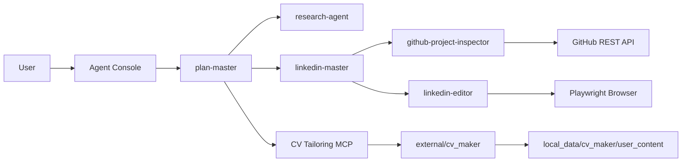

# OfferGraph

<p align="center">
  
</p>

<p align="center">
  
  
  
  <a href="https://github.com/jhcook/cv">
    
  </a>
</p>

An Offer hunter ai agent team based on LangGraph, allowed monitor and future customize, and have manus agent error memory feat, to give users a free, efficient, cheap way to get easy offer.

## What OfferGraph Does

OfferGraph is an agent workspace for the offer-hunting loop: planning, research,
LinkedIn content, CV tailoring, and browser-assisted workflows with explicit
approval gates.

| Area | Capability |
| --- | --- |
| Plan Master | Coordinates research, sub-agents, TODOs, and workflow handoffs |
| LinkedIn Master | Creates LinkedIn post drafts and routes browser publishing through approval gates |
| CV Tailoring MCP | Runs CV tailoring as a separate MCP service that agents can call |
| GitHub Project Data | Reads repository metrics and recent project progress for LinkedIn content |
| Browser Tools | Uses Playwright for authenticated LinkedIn flows |
| Safety Controls | Keeps login, publishing, and future application submission user-controlled |

## Architecture



## Setup

```bash
/opt/homebrew/bin/python3.11 -m venv .venv
source .venv/bin/activate
python -m pip install --upgrade pip
python -m pip install -r requirements.txt
cp .env.example .env
```

Fill `.env` with local secrets:

```bash
TAVILY_API_KEY=...
MINIMAX_API_KEY=...
# Optional, for higher GitHub API rate limits.
GITHUB_TOKEN=...
```

## Agent Console

Start the top-level OfferGraph agent:

```bash
./offergraph
```

This opens a chat loop controlled by `plan-master`. It loads CV Tailoring tools
over stdio by default, so you do not need a second terminal for normal use.

Exit with `/exit`.

Run a single non-interactive task:

```bash
./offergraph --message "Find AI Engineer roles and prepare applications."
```

Optional advanced examples:

```bash
./offergraph --agent linkedin-master --message "Write a concise OfferGraph LinkedIn post."
./offergraph --choose-model
./offergraph --without-cv-tailoring-mcp
```

## Tool Approval Mode

Tools default to `approve-mode`, which returns an approval request before running flows that need user consent.

```bash
export OFFERGRAPH_TOOL_MODE=approve-mode
```

Use `auto-mode` only when you want tools to skip approval gates:

```bash
export OFFERGRAPH_TOOL_MODE=auto-mode
```

To initialize LinkedIn auth state manually:

```bash
./.venv/bin/python -m playwright install chromium
./.venv/bin/python scripts/setup_linkedin_auth.py
```

## GitHub Project Data

LinkedIn content workflows can inspect public GitHub repositories before drafting
project-progress posts. When a user request includes a GitHub URL or `owner/repo`
reference, `linkedin-master` can call:

```text
github-project-inspector
```

The tool saves repository evidence into the agent file system, including:

- stars, forks, watchers, open issues, language, topics, license, and last push
- recent pull requests, issues, commits, and releases
- an optional README excerpt

Use `GITHUB_TOKEN` in `.env` for higher GitHub API rate limits. Public
repositories can still be inspected without a token.

## CV Tailoring MCP

OfferGraph vendors the AI CV Maker source under:

```bash
external/cv_maker
```

Private CV inputs, templates, generated resumes, and logs live outside git under:

```bash
local_data/cv_maker/user_content
```

The MCP server keeps `external/cv_maker/user_content` linked to that ignored
local data directory. You can override these paths in `.env`:

```bash
CV_MAKER_PROJECT_ROOT=external/cv_maker
CV_MAKER_USER_CONTENT_DIR=local_data/cv_maker/user_content
CV_TAILORING_MCP_URL=http://127.0.0.1:8765/mcp
```

For normal local use, `./offergraph` loads CV Maker through stdio automatically.
If you need to run the MCP service separately for debugging, start it in terminal 1:

```bash
./.venv/bin/python -m mcp_servers.cv_tailoring.server \
  --transport streamable-http \
  --host 127.0.0.1 \
  --port 8765 \
  --path /mcp
```

Then run the agent system in terminal 2 and point it at the HTTP MCP service:

```bash
./offergraph --cv-tailoring-transport streamable_http
```

At runtime, the agent process is the MCP client and the CV Maker process is the
MCP server. The agent uses only the MCP tools; it does not import CV Maker
internals directly.

Provided tools:

- `cv_tailoring_health`: checks the vendored CV Maker project and Python runtime.
- `cv_tailoring_list_models`: delegates to `run.py --list-models`.
- `cv_tailor_resume`: generates a tailored CV and cover letter from JD text, JD path, or JD URL.

## Project Layout

```text
agent/                 Agent builders, prompts, model selection, MCP clients
tools/                 LangChain tools and browser/auth helpers
mcp_servers/           Local MCP services exposed to agents
external/cv_maker/     Vendored CV Maker source, inspired by jhcook/cv
local_data/            Ignored personal CV data and generated files
scripts/               Local setup and console entrypoints
test/                  Unit tests for agents, tools, scripts, and MCP services
```

## Safety Notes

- `.env`, `.auth/`, and `local_data/` are ignored by git.
- LinkedIn publishing requires terminal confirmation before clicking Post.
- CV personal data stays in `local_data/cv_maker/user_content`.
- The agent process uses CV Maker through MCP; it does not import CV Maker internals directly.

## Attribution

The CV tailoring service is based on and adapted from
[jhcook/cv](https://github.com/jhcook/cv).
